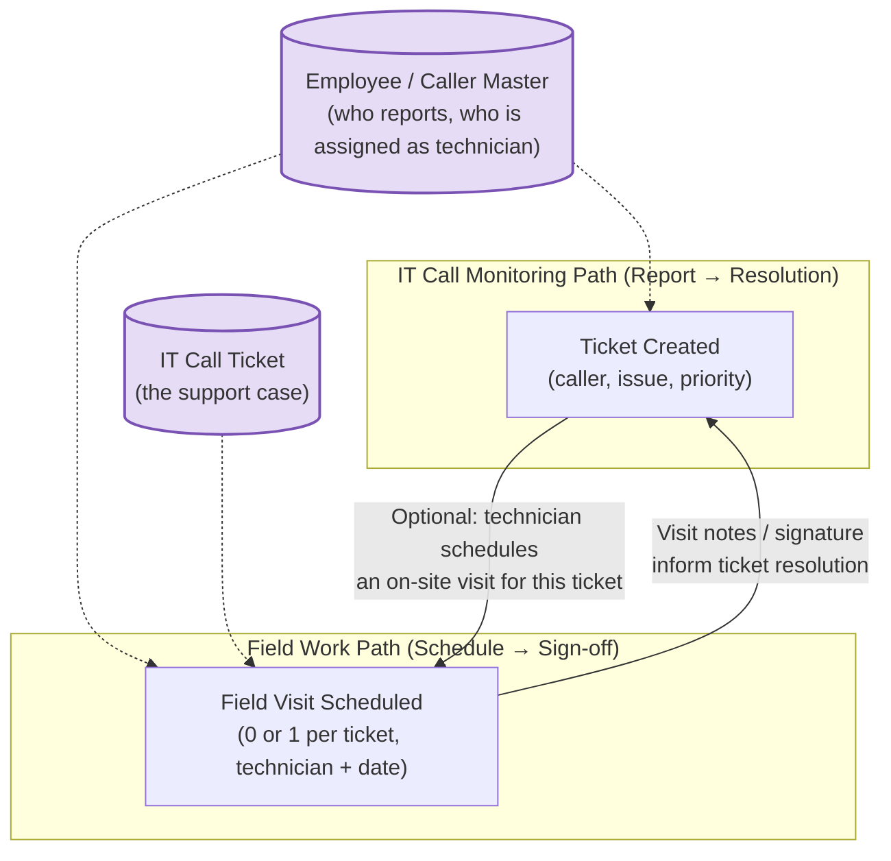
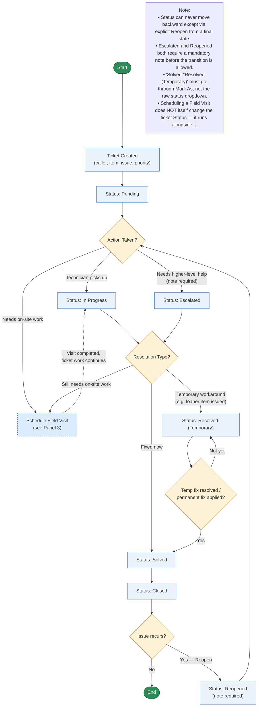
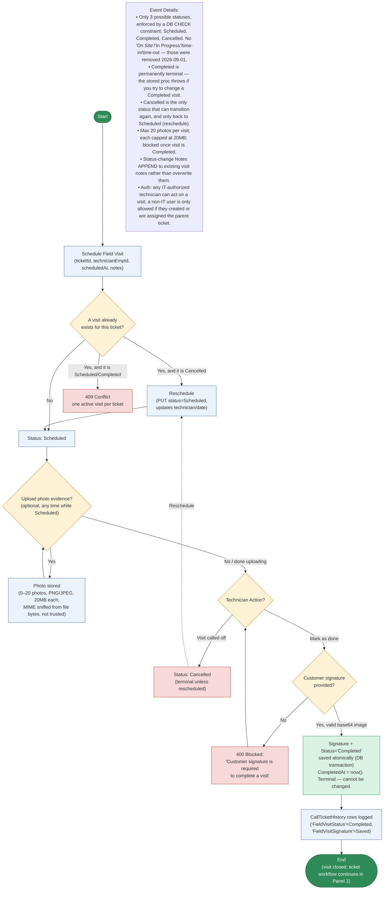

# IT Call Monitoring + Field Work — Flowchart Pack (Repair Portal excluded)

Scoped to only the two systems requested: **IT Call Monitoring** (ticket lifecycle) and its
**Field Work** component (`CallFieldVisit` — on-site technician visits scheduled against an IT
Call ticket, with photo evidence and customer signature). Repair Portal is a separate module and
is intentionally NOT included here.

Structured the same way as the reference image: an overview panel (shared entities + relationship
between ticket and field visit), then two detailed lifecycle panels, each Start → End with
decision diamonds and an "Event Details"/"Note" callout. Paste any Mermaid block into ChatGPT web
or mermaid.live to render/redraw.

---

## Panel 1 — Overall Relationship (IT Call Ticket ↔ Field Visit)

**Key relationship notes:**
- A Field Visit is **optional and 1:1 with a ticket** — a ticket does not require a field visit,
  and only one active visit can exist per ticket at a time (`POST` returns 409 if one already
  exists, including a Cancelled one — that case must be rescheduled via `PUT`, not re-created).
- The Field Visit is a **sub-workflow nested inside** the ticket's own lifecycle, not a separate
  bridged ticket type (unlike Repair Portal) — it doesn't change the ticket's own Status field by
  itself; it's supporting evidence/scheduling data attached to the ticket.
- Completing a visit is **hard-gated by a customer signature** — the API rejects `Completed`
  with no signature bytes decoded, whether that's from a fresh submission or a previously empty
  one.

---

## Panel 2 — IT Call Monitoring Detailed Lifecycle

---

## Panel 3 — Field Work (Field Visit) Detailed Lifecycle

**Verified directly against the live DB constraint and canonical stored procedure**
(`Migration_ITCM_FieldVisit_CanonicalStateMachine.sql`):
`CK_CallFieldVisit_Status CHECK (Status IN ('Scheduled','Completed','Cancelled'))`.
**There is no time-in/time-out, no "On Site," no "In Progress" state for Field Work.**
Those intermediate states (`InTransit`, `CheckedIn`, `CheckedOut`) plus their
`CheckedInAt`/`CheckedOutAt` timestamp columns **did exist in an earlier design and were
deliberately removed** on 2026-09-01 per `Migration_ITCM_FieldWork_SimplifyStateMachine.sql`
("Remove InTransit, CheckedIn, CheckedOut intermediate states... Remove time tracking fields").
Photo/signature capture happens while still `Scheduled` — completing the visit is a single
direct transition, not a separate step after some on-site/checked-in state.

---

## Source references used to build this (IT Call + Field Work only)

- `Forms\CallMonitoring\TicketWorkflow.cs` — canonical IT Call status catalog, rank order, and
  allowed-transition rules (no backward movement; Reopened/Escalated gating).
- `Forms\CallMonitoring\TicketManagementControl.StatusWorkflow.cs` — UI-level enforcement
  (note-required prompts, Mark As redirection for Solved/Resolved (Temporary), Reopen flow).
- `Yakult.Inventory.Api2_remote\call-field-visits.ashx` — Field Visit state machine
  (`Scheduled → Completed / Cancelled`, `Cancelled → Scheduled` reschedule), signature-gated
  completion, calls `dbo.sp_Call_FieldVisit_Schedule` / `dbo.sp_Call_FieldVisit_SetStatus`.
- `Yakult.Inventory.Api2_remote\call-field-visit-photo-upload.ashx` — evidence photo upload for a
  visit: 20MB/file, 20 files/visit cap, magic-number MIME sniffing (PNG/JPEG only), blocked once
  visit is Completed, 400px/85% JPEG thumbnail generation.
- `Yakult.Inventory.Api2_remote\call-ticket-action.ashx` — mobile mirror of the desktop ticket
  actions (`status`, `priority`, `note`, `assign`, `resolution`) confirming the same ticket
  lifecycle is shared by desktop and mobile/field technicians.
- `AGENTS.md` note on `vw_Call_TicketList` / mobile dry run — confirms mobile field flow (create →
  field visit → photo upload → status changes) writes into these same `CallTicket` /
  `CallFieldVisit` tables via this API, not a separate system.
