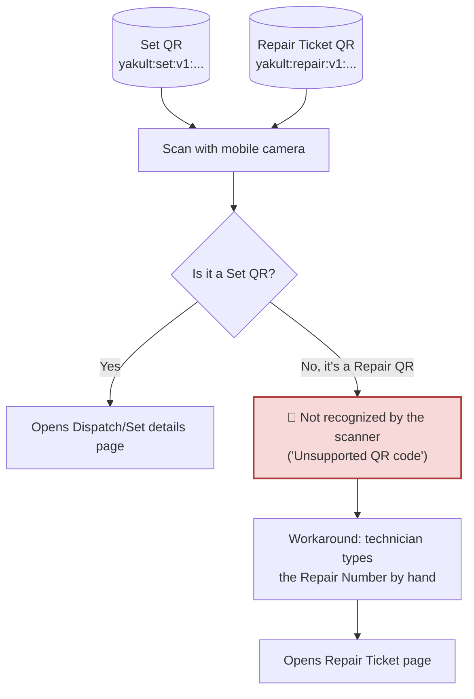
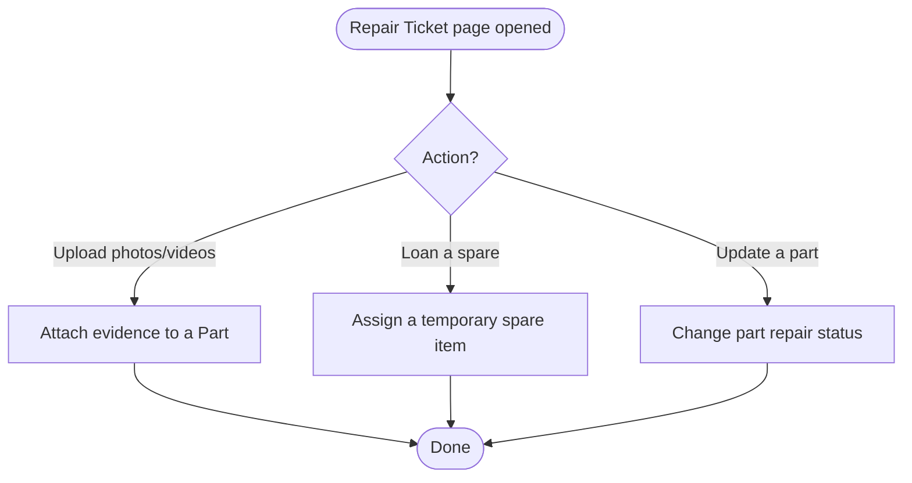
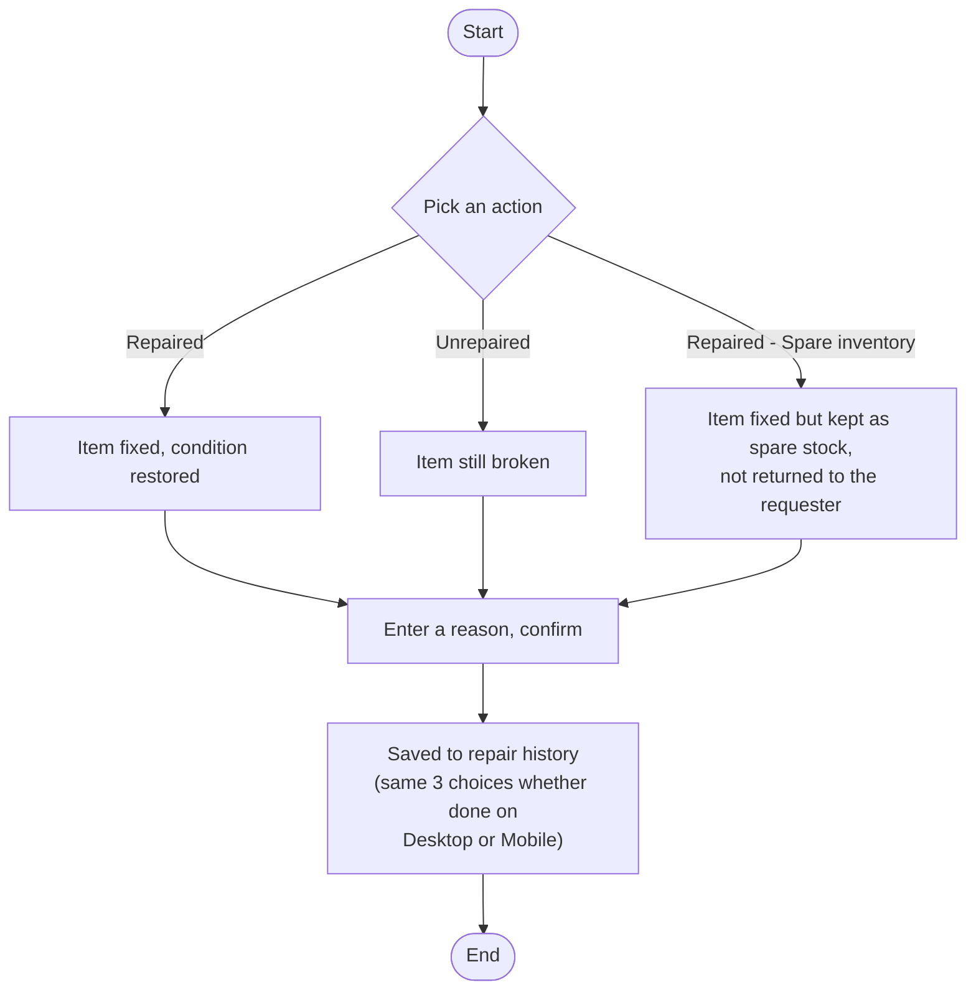

# QR (Set/Repair → Mobile → Repair Page) + Mark as Spare/Repaired — Simple Version

## Panel 1 — How each QR code is scanned and where it leads

**Key point:** The mobile scanner only understands Set QR codes right now. Scanning a Repair
Ticket's QR code fails with "Unsupported QR code" — technicians have to type the Repair Number
manually instead. This is a real gap in the current app, not expected behavior.

---

## Panel 2 — Once on the Repair Ticket page, what can the technician do?

---

## Panel 3 — Mark as Spare / Repaired / Unrepaired

**Where this happens:**
- Desktop: Repair Items page → Mark Repaired / Mark Unrepaired / Mark Spare buttons.
- Mobile: resolving an IT Call ticket with a replacement item — same 3 choices for the old item.
