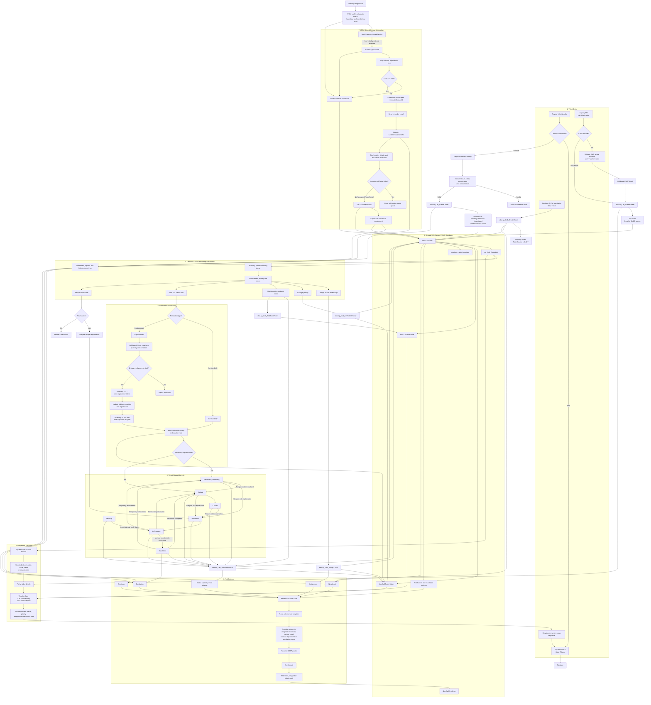

# Yakult IT Call Monitoring and Ticketing Workflow

This document describes the end-to-end ticket lifecycle across the Systems Portal, legacy API, desktop IT Call Monitoring workspace, shared SQL Server database, notifications, and ITCM scheduler.

## Primary status path

`Pending → In Progress → Escalated → Resolved (Temporary) → Solved → Closed`

A final ticket may be reopened:

`Solved / Resolved (Temporary) / Closed → Reopened → In Progress`

## Main implementation locations

- Portal entry and tracking: `Yakult.SystemsPortal/Controllers/HelpItController.cs`, `Repositories/HelpItRepository.cs`
- Legacy API entry and actions: `Yakult.Inventory.Api2_remote/call-tickets.ashx`, `call-ticket-action.ashx`
- Desktop ticket workspace: `Yakult.Inventory.App/Forms/CallMonitoring/TicketManagementControl.cs`, `Wpf/CallMonitoring/WpfTicketManagementWorkspace.cs`
- Desktop status rules: `Yakult.Inventory.App/Forms/CallMonitoring/TicketWorkflow.cs`
- Desktop database operations: `Yakult.Inventory.App/Repositories/CallMonitoringRepository.cs`
- Desktop notifications and background jobs: `Yakult.Inventory.App/Services/CallEmailNotificationService.cs`
- ITCM scheduler: `Yakult.ITCM.Server/Services/ItcmSchedulerHostedService.cs`, `ItcmBackgroundJob.cs`
- ITCM database and locking: `Yakult.ITCM.Server/Data/ItcmRepository.cs`
- ITCM monitoring endpoints: `Yakult.ITCM.Server/Program.cs`
