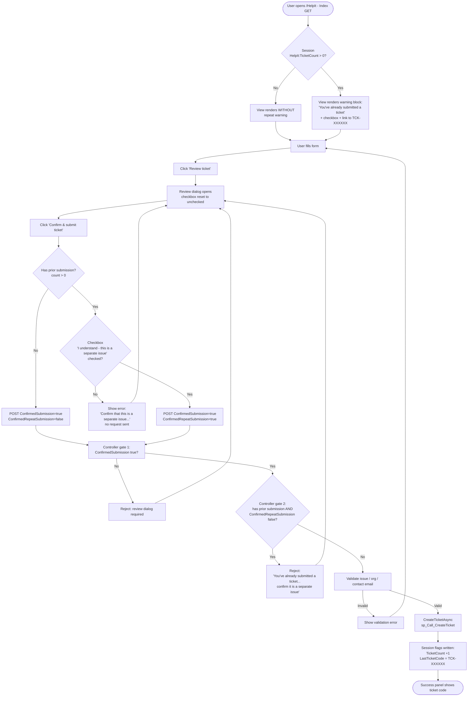

# Help IT — Repeat Submission Confirmation Flowchart

Flow of the "You've already submitted a ticket" confirmation added to the Systems Portal Help-IT ticket submission (`HelpItController.cs` / `Views/HelpIt/Index.cshtml`).

## Legend

| Shape | Meaning |
|---|---|
| `[ ]` | Server-side step (controller / repository / session) |
| `( )` | Entry / exit point |
| `{ }` | Decision gate |
| `Diamond` | Client-side (browser) decision |

## Status transitions

| State | Transition |
|---|---|
| No prior ticket | Session `HelpIt:TicketCount` absent or 0 → flow identical to original single-confirm behavior |
| 1st submission succeeds | Count incremented to 1, `HelpIt:LastTicketCode` set → warning armed |
| 2nd+ submission (same session) | Warning shown; checkbox required client-side; `ConfirmedRepeatSubmission=true` required server-side |
| Session expires (8h) / new browser | Count resets → warning clears |
